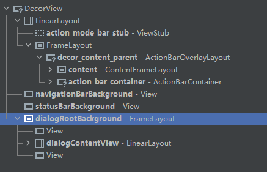

# Demo

1.  [FullTransparentActivity.kt](app_learn\src\main\java\com\vihanmydemo\app_learn\demo\FullTransparentActivity.kt) : 实现透明背景的Activity

2.  [ScreenShotActivity.kt](app_learn\src\main\java\com\vihanmydemo\app_learn\demo\ScreenShotActivity.kt) : Activity截图(View截图 > DecorView截图)

3.  [WindowAndViewActivity.kt](app_learn\src\main\java\com\vihanmydemo\app_learn\demo\windowandview\WindowAndViewActivity.kt) : 

   ```
   1. 使用 WindowManager 对Activity对应的winow中添加View
   2. 可以通过向 DecorView 这个 FrameLayout 添加View以实现显示弹窗的功能
   3. 改变导航栏和状态栏占位view的背景色
   ```

# Q&A

## 为什么添加到DecorView的View能够延伸到状态栏和导航栏区域但是却不能覆盖导航栏和状态栏的内容



```
导航栏和状态栏属于系统级组件，它们处于应用程序窗口之上，并由系统进行管理和控制。因此，应用程序无法直接覆盖导航栏和状态栏。

decorView中的 navigationBarBackgroung 和 statusBarBackground 只是一个占位
```

